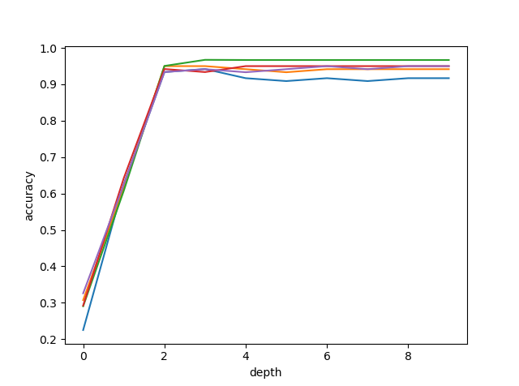
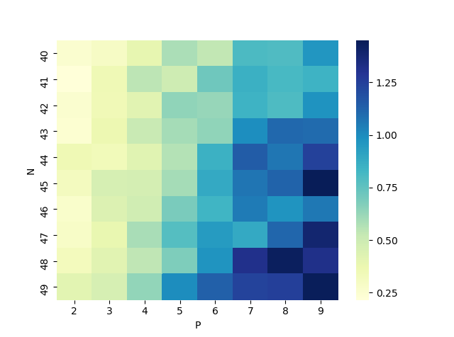
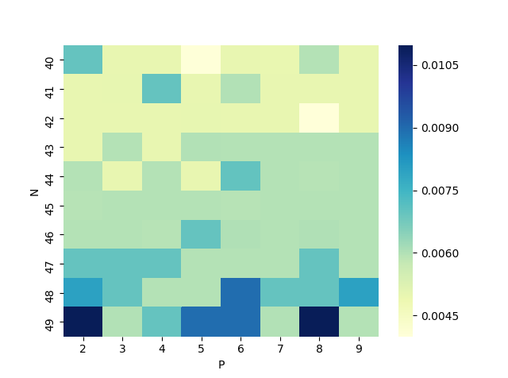
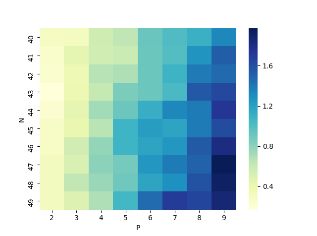
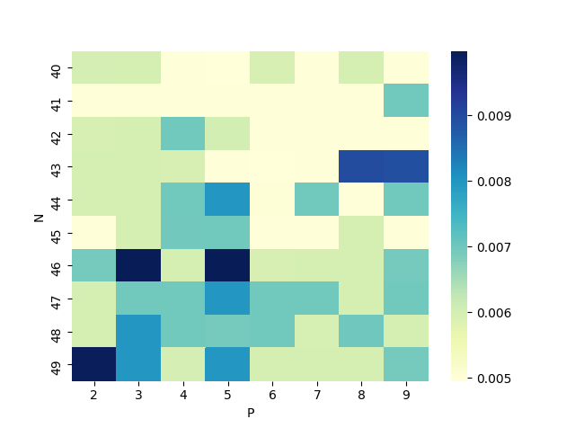
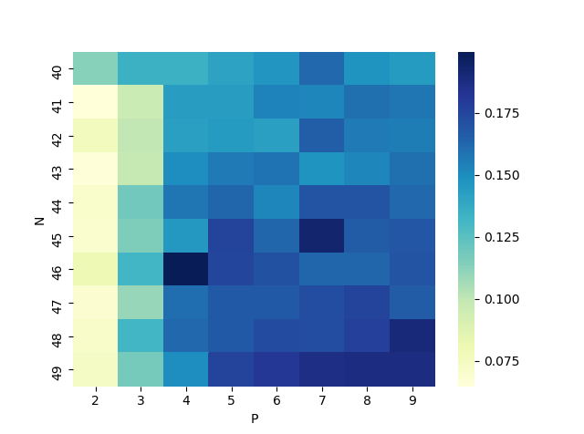
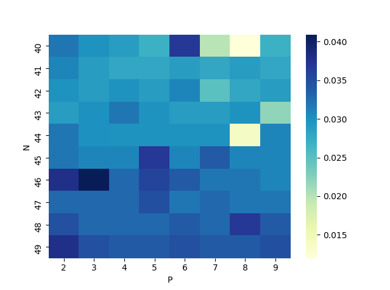

# ES654-2020 Assignment 1

Chandan Maji - 17110037

------

> Write the answers for the subjective questions here

# QUESTION 2 (iris-experiments.py):

## PART a: 

With max-depth = 3 and 70:30 split into train and test, the results are as follows:

Criteria : information_gain
Train Accuracy:  0.9619047619047619             Test Accuracy:  0.9555555555555556
Class = Iris-versicolor                     Precision:  0.9411764705882353                  Recall:  0.9411764705882353
Class = Iris-setosa                         Precision:  1.0                                 Recall:  1.0
Class = Iris-virginica                      Precision:  0.9444444444444444                  Recall:  0.9444444444444444

Criteria : gini_index
Train Accuracy:  0.9619047619047619         Test Accuracy:  0.9555555555555556
Class = Iris-versicolor                     Precision:  0.9411764705882353                  Recall:  0.9411764705882353
Class = Iris-setosa                         Precision:  1.0                                 Recall:  1.0
Class = Iris-virginica                      Precision:  0.9444444444444444                  Recall:  0.9444444444444444

## PART b:

Using 5 fold cross-validation:
Max Depth = 3
Average Accuracy: 0.9466666666666667

Optimum Depth using nested cross-validation = 3

Plots of accuracy vs depth of the 5 folds can be found in the path below:

# QUESTION 3 (estate-experiments.py):

## PART b:

70:30 split into train and test data sets, the results are as follows:

With max-depth=2:
Using MY MODEL:
RMSE:  8.2916                             MAE:  6.0610
Using SKLEARN's MODEL:
RMSE:  8.2916                              MAE:  6.0610

With max-depth=3:
Using MY MODEL:
RMSE:  7.5959                             MAE:  5.5518
Using SKLEARN's MODEL:
RMSE:  9.9485                              MAE:  6.0709

With max-depth=4:
Using MY MODEL:
RMSE:  7.6893                             MAE: 5.6043
Using SKLEARN's MODEL:
RMSE:  10.0420                             MAE:  6.1513

# QUESTION 4:

N = Number of samples
M = Number of attributes
d = depth of the tree
c = max number of classes, only in case of discreate inputs

### Case 1: Real Input Real Output

Theoretical Fit Time Complexity: O(MN^2) for creating each tree node, so total time taken is O(2^d*(MN^2))
Fit Times heatmap: 

Theoretical Predict Time Complexity: O(d) for creating each tree node
Predict Times heatmap: 

### Case 2: Real Input Discreate Output

Theoretical Fit Time Complexity: O(MN^2) for creating each tree node, so total time taken is O(2^d*(MN^2))
Fit Times heatmap: 

Theoretical Predict Time Complexity: O(d) for creating each tree node
Predict Times heatmap: 

### Case 3: Discreate Input Discreate Output

Theoretical Fit Time Complexity: O(MN) for creating each tree node, so total time taken is O(c^d*(MN))
Fit Times heatmap: 

Theoretical Predict Time Complexity: O(d) for creating each tree node
Predict Times heatmap: 

### Case 4: Discreate Input Real Output

Theoretical Fit Time Complexity: O(MN) for creating each tree node, so total time taken is O(c^d*(MN))
Fit Times heatmap: 

Theoretical Predict Time Complexity: O(d) for creating each tree node
Predict Times heatmap: 

